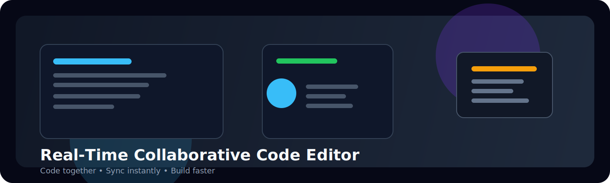
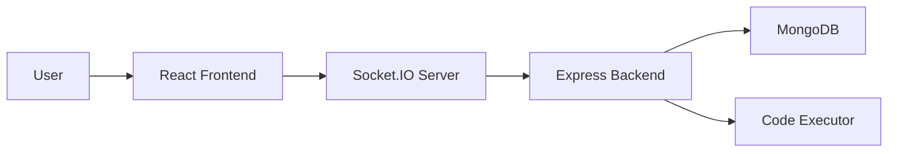

# Real-Time Collaborative Code Editor

<div align="center">
  
</div>

<p align="center">
  
  
  
  
</p>

A polished full-stack collaboration platform where multiple users can join a shared coding room, edit code together in real time, chat live, and run JavaScript code instantly. Built for pair programming, remote teamwork, and interactive demos.

## ✨ Highlights

- Real-time collaborative editing with live sync across users
- Room-based sessions for focused teamwork
- User authentication and secure room access
- Live chat inside each shared workspace
- JavaScript code execution from the editor
- MongoDB-backed persistence for room state and user data

## 🧠 Project Flow



## 🛠 Tech Stack

- Frontend: React, Vite, Socket.IO Client
- Backend: Node.js, Express, Socket.IO
- Database: MongoDB
- Auth: Custom token-based authentication
- Testing: Node.js built-in test runner

## 📁 Project Structure

```text
real-time-collaborative-code-editor/
├── backend/
│   ├── src/
│   │   ├── auth.js
│   │   ├── database.js
│   │   ├── execution.js
│   │   ├── server.js
│   │   └── sessionStore.js
│   └── test/
├── frontend/
│   ├── src/
│   │   ├── App.jsx
│   │   ├── main.jsx
│   │   └── styles.css
│   └── index.html
└── package.json
```

## 🚀 Getting Started

### Prerequisites

- Node.js 18+
- MongoDB running locally or a remote MongoDB URI

### 1) Install dependencies

```bash
npm install
```

### 2) Configure environment variables

Create a `.env` file in the backend folder with:

```env
PORT=5000
MONGODB_URI=mongodb://127.0.0.1:27017
MONGODB_DB=collab-editor
JWT_SECRET=your-secret-key
```

### 3) Start the app

```bash
npm run dev
```

This starts:

- Backend server on `http://localhost:4000`
- Frontend Vite app on `http://localhost:5173`

### 4) Verify health

```bash
curl http://localhost:5000/health
```

## 🧪 Testing

```bash
npm test
```

## 🔧 API Overview

- `POST /register` — Create a new user account
- `POST /login` — Authenticate a user
- `POST /execute` — Run JavaScript code
- `GET /health` — Health check endpoint

# Live Demo

🌐 Frontend: https://real-time-collaborative-code-editor-zeta.vercel.app

## Tech Stack

- React
- Node.js
- Express.js
- Socket.IO
- MongoDB
- Vite

## Features

- Real-time collaborative editing
- Room-based collaboration
- Live active users
- Syntax highlighting
- Multiple language support
- Code execution
- Responsive UI

## 🤝 Contributing

Contributions are welcome. If you would like to improve the project, please open an issue or submit a pull request.

## 📜 License

This project is open-source and available under the MIT License.
